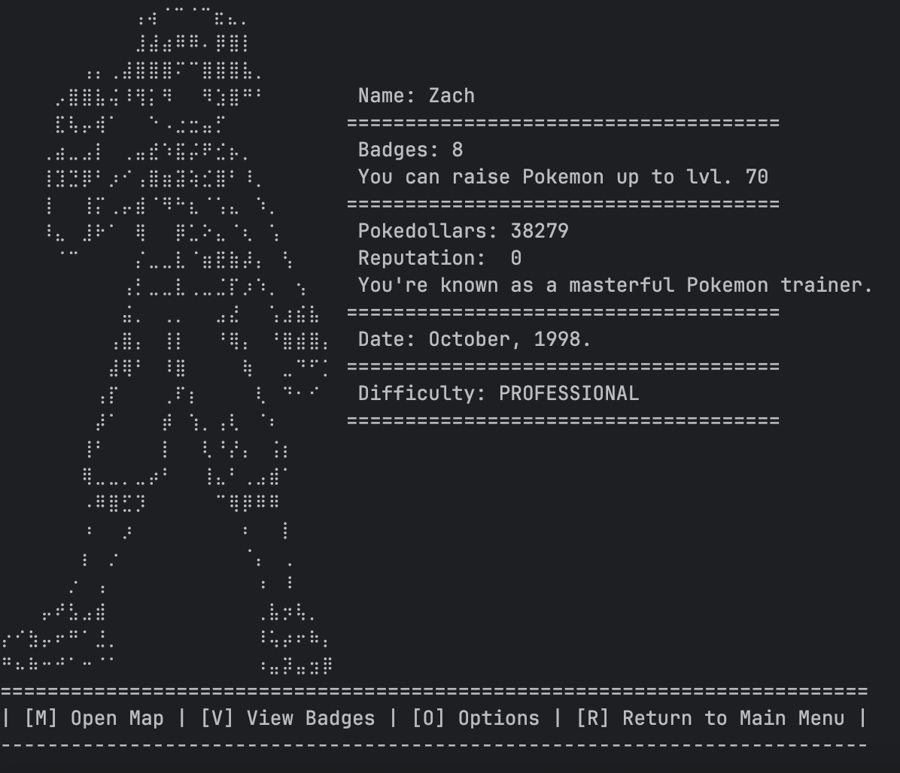
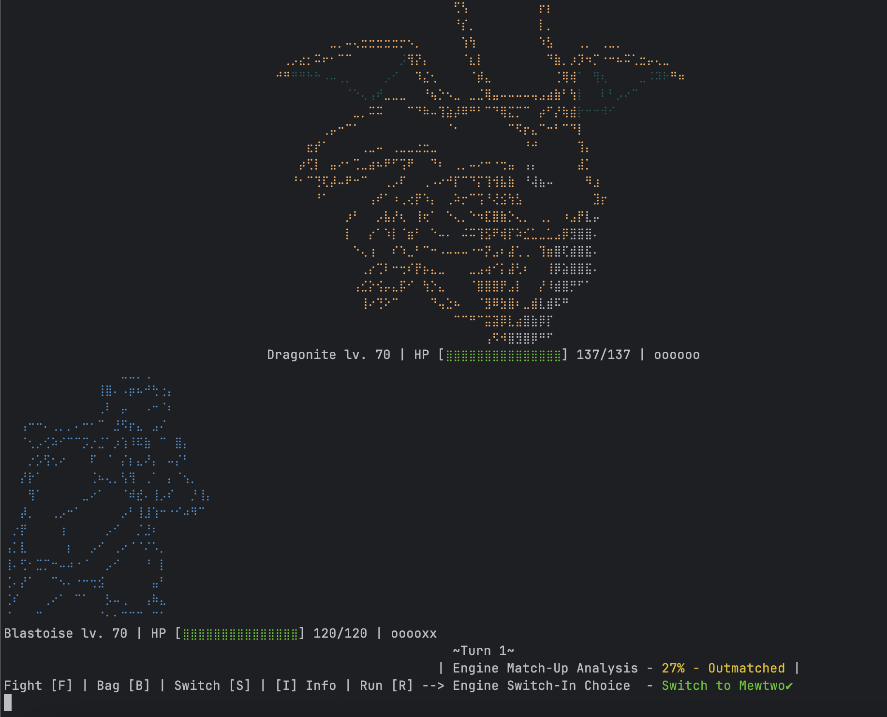
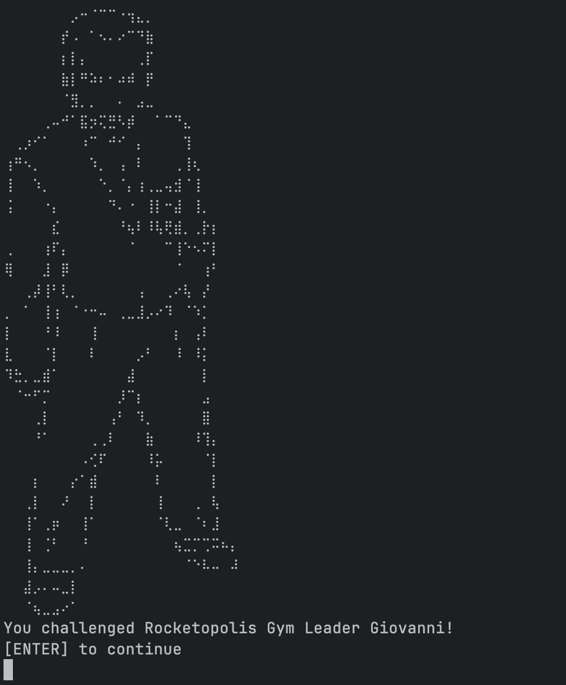
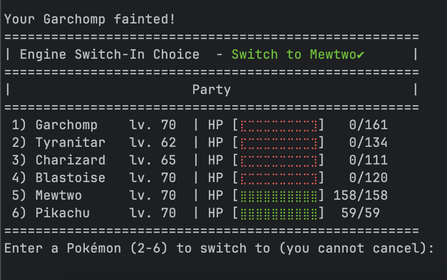
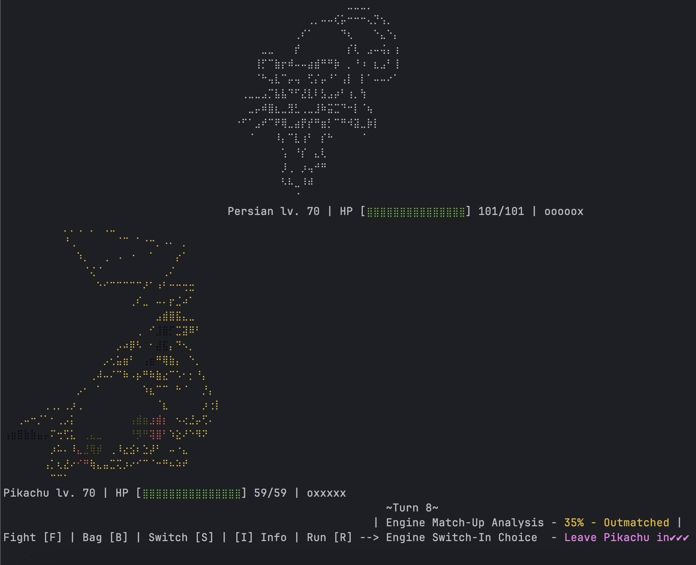
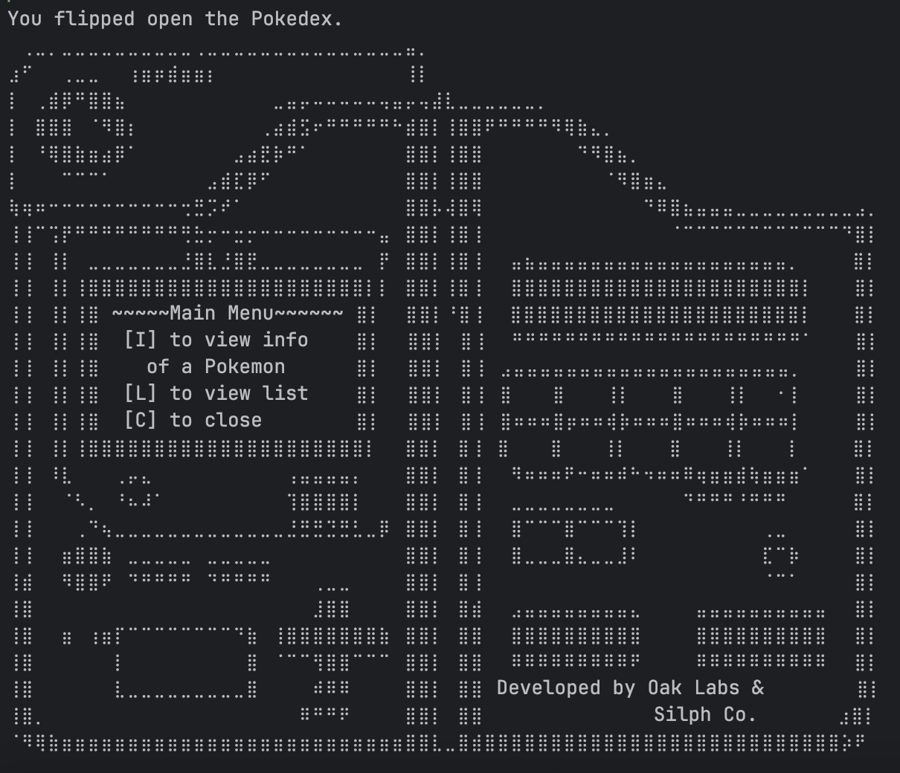
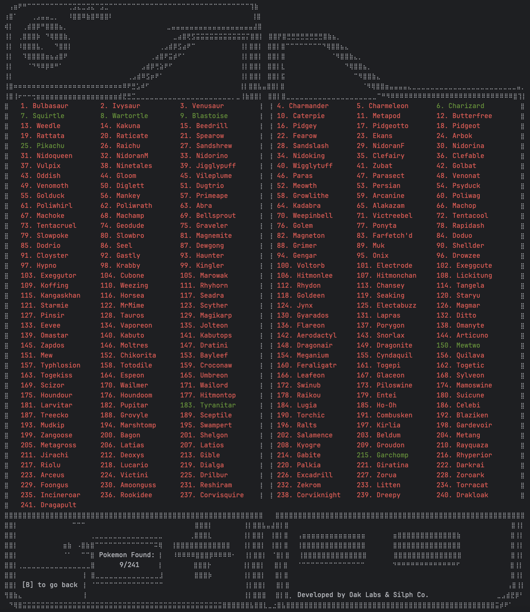
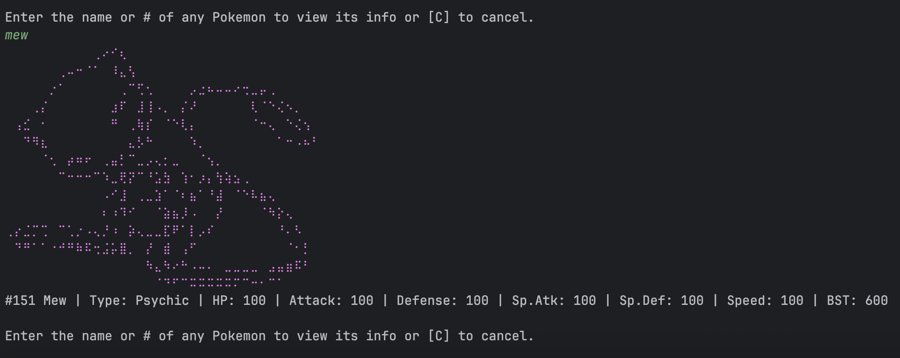

# pokemonTextBasedJavaEdition

### (A.K.A. pokemon_tbje) - by Zach Mahan

**A terminal-based Pokémon battle game, written in Java, complete with 241 species, faithful game mechanics, adjustable difficultly, dynamic AI, procedurally generated opponents, random wild encounters, competitive battles, and custom graphics. Built from scratch over 2 months.**

## Features

- 241 Pokémon with stats, types, evolutions, moves, and sprites
- Real battle mechanics: type matchups, stat changes, status effects, weather
- Smart AI trained via custom in-game ML multi-threaded simulation engine
- Dynamic difficulty scaling, procedurally generated trainers/opponents
- Full single-player campaign: gym leaders, wild encounters, Team Rocket, Colosseum, 
- Terminal UI using Unicode + ANSI escape strings
- Catching system, items, switching, trick room, and more
- Save file system to track all progress

## How to Run

1. Clone the repo:
   - Open a terminal (recommendations: Mac - iTerm2 | Linux - Kitty/Konsole | Windows - MSYS2)
   - `cd <where/you/keep/java/projects>`
   - `git clone https://github.com/zachMahan64/pokemonTextBasedJavaEdition.git`
2. Compile & run:
   - Make sure you have the latest versions of Java (>=24 required) and Maven before proceeding.
   - `cd <where/you/keep/java/projects>/pokemonTextBasedJavaEdition`
   - `mvn clean package` (this builds w/ Maven)
   - `java -jar target/pokemon_tbje-1.0.jar`
   - Enjoy the game
3. Make sure terminal font is size is < 14.0 (not too important as long as you have at least ~70 rows) and line spacing is set to 1.0 (crucial for visual proportions)!
4. Remember, the visuals may not look right if you're on a Windows terminal or not using a mono-spaced font (mono-space propo is also okay).

## AI Engine

The AI/Analysis Engine:
- Analyzes matchups in real-time based on game state and 30+ engine parameters
- Trained with smart parameter tweaking algorithm which uses 1-prop z-tests to check for statistical significance on improvements from parameter tweaks
- Scores moves and switches with a point total system
- Provides live move/switch recommendations & shows match-up & move ratings
- Allows player to run battle simulations mid-game to estimate win probabilities
- Opposing trainers never blunder on `PROFESSIONAL` difficulty (except for an intentional .1% of the time). Trainers in `CHALLENGE` are similarly smart most of the time but choose 2nd and 3rd best moves more often. In `NORMAL`, they choose less optimal moves more often, and, in `EASY`, they choose nearly random moves.
- This was probably the hardest part of the entire game to program (besides, well, writing the entire battle logic for Pokémon from scratch)
- **See screenshot section for the game analysis interface**

## Visuals & Audio

- Uses Unicode braille characters as pixel-art dot matrices. Also uses ANSI escape strings for color.
- Also coloring was done by hand.
- Dot-converted Pokémon, trainer, and location images. Used: https://emojicombos.com/dot-art-generator (amazing website, btw).
- Background music & sound effects via JavaFX (YouTube-sourced MP3s, I do not own the rights)
- **See screenshot section to view visuals for yourself**

## Platform Support

- Works best on **Mac/Linux** terminals.
- Windows' terminal may clobber the visuals a bit due to character spacing issues.
- Potential build issues: JavaFx packages are platform dependent and may cause issues! However, the build process I laid out should work, but Maven is absolutely required.

## Notes

- This was my first project. Some early code is messy. Much of it has been painstakingly refactored, but core design issues remain (largely stemming the overuse of global state).
- Project on hold for now, might add more features in the future or use the game core for a proper GUI version.
## Screenshots

^ see the match-up analysis interface (and our shiny charizard)

^ map coloring isn't completely finished (manually insering ansi escape strings is quite tedious)

^ see move rating interface

^ see the largest among the game's cities; there are a lot of activities to do

^ route 19 (a water route along the sea)

^ lvl 5 squirtle vs lvl 40 celebi; match-up doesn't look great for us

^ the outside of the battle colosseum, fun

^ the inside of the colosseum, this is a long battle rush where opponents' parties scale to your party's size, level, and stats. you get progressively more BP (battle points) as your win streak increases and you can steal one of your opponents pokemon in each battle after reaching 25 record wins in a row. this is a quick way to get many rare pokemon.

^ play menu -> open map to go to locations, etc. see badges, level cap, reputation, etc are tracked. the date is based on the in-game storyline. the difficulty is shown ('PROFESSIONAL' is the hardest with the smartest opponents). 

^ tyranitar vs venusaur; doesn't look good for us, we should switch to mewtwo!

^ exterior of a gym

^ another gym exterior

^ blastoise vs dragonite

^ Giovanni, one of the hardest gym leaders you face

^ what you see when you have to switch in a battle. here, the engine is saying to switch to mewtwo!

^ pikachu, save us! see how he's our last pokemon left (as indicated by `oxxxxx`). `o` is our alive pikachu and each `x` is a fainted party member!

^ the pokedex menu!

^ list of all pokemon in the pokedex; red is uncaught and green are caught pokemon.

^ searching up mew in pokedex! look at all that sweet data