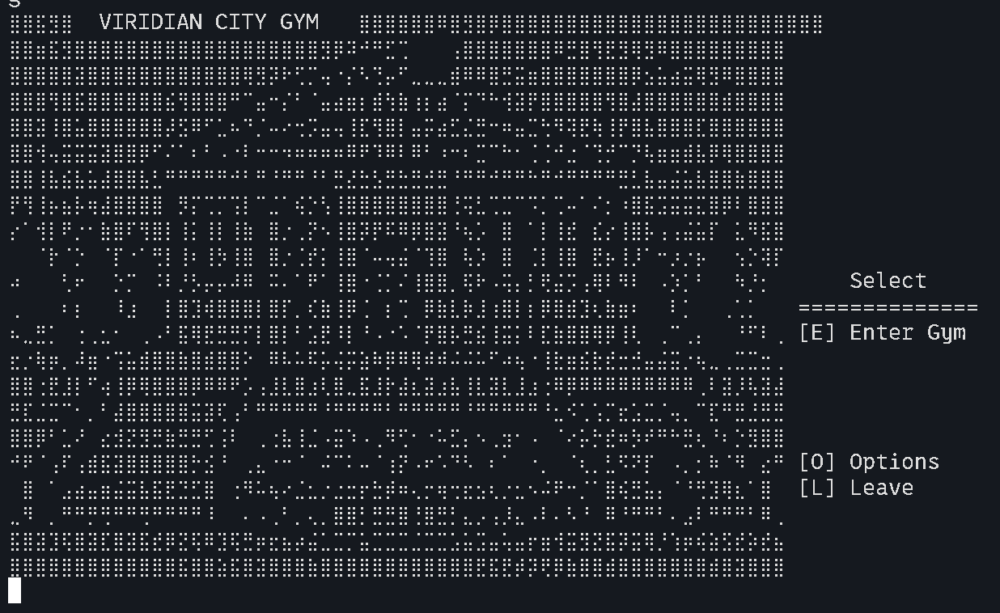

# pokemonTextBasedJavaEdition

### AKA pokemon_tbje

A terminal-based Pokémon battle game, written in Java, complete with 250 species, true-to-original mechanics, dynamic AI, and custom graphics. Built from scratch over 2 months.

## Features

- 250 Pokémon with stats, types, evolutions, and images
- Real battle mechanics: type matchups, stat changes, status effects
- Smart AI trained via custom in-game ML multi-threaded simulation engine
- Dynamic difficulty scaling
- Full single-player campaign: gym leaders, wild encounters, Team Rocket
- Terminal UI using Unicode + ANSI escape strings (Mac/Linux recommended)
- Catching system, items, switching, trick room, and more
- Save file system

## How to Run

1. Clone the repo:
   - Open a terminal (recommendations: Mac - iTerm2 | Linux - Kitty/Konsole | Windows - MSYS2)
   - `cd <where/you/keep/java/projects>`
   - `git clone https://github.com/zachMahan64/pokemonTextBasedJavaEdition.git`
2. Compile & run:
   - Make sure you have the latest versions of Java (>=24 required) and Maven before proceeding.
   - `cd <where/you/keep/java/projects>/pokemonTextBasedJavaEdition`
   - `mvn clean package` (this builds w/ Maven)
   - `java -jar target/pokemon_tbje-1.0.jar`
   - Enjoy the game
3. Make sure terminal font is size 12-14 and line spacing is set to 1.0!
4. Remember, the visuals will likely not look right if you're on a Windows terminal. Try a Linux VM for a better experience.

## AI Engine

The AI/Analysis Engine:
- Analyzes matchups in real-time based on game state and 30+ engine parameters
- Provides live move/switch recommendations & shows match-up & move ratings
- Allows battle simulations mid-game to estimate win probabilities
- Avoids blunders and scales in strength
- This was probably the hardest part of the entire game to program (besides, well, writing the entire battle logic for Pokémon from scratch)

## Visuals & Audio

- Uses Unicode braille characters as pixel-art dot matrices. Also uses ANSI strings for color.
- Dot-converted Pokémon, trainer, and location images
- Background music & sound effects via JavaFX (YouTube-sourced MP3s, I do not own the rights)

## Platform Support

- Works best on **Mac/Linux** terminals.
- Windows support is limited due to character spacing issues.

## Notes

- This was my first project. Some early code is messy. Most of it has been painstakingly refactored. Multiple times.
- Project on hold for now, might add more features in the future or use the game core for a proper GUI version.
## Screenshots

^ map coloring isn't completely finished (manually insering ansi escape strings is quite tedious)

